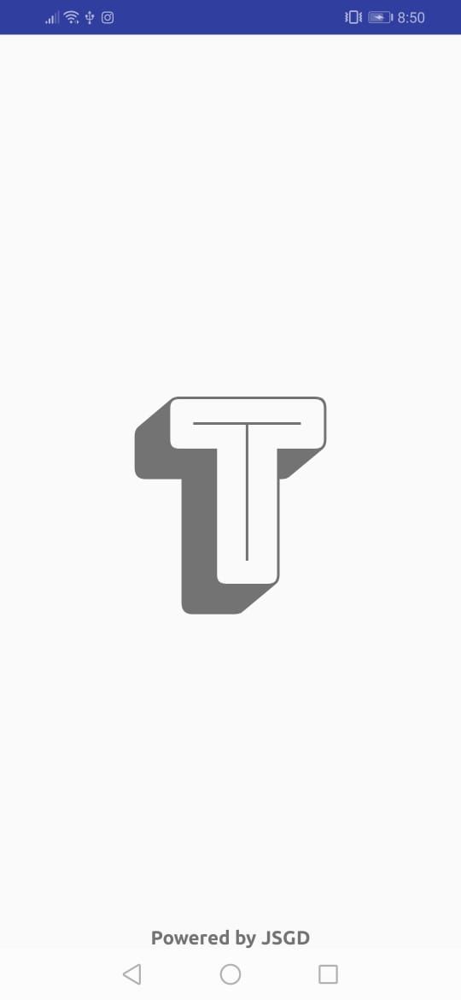
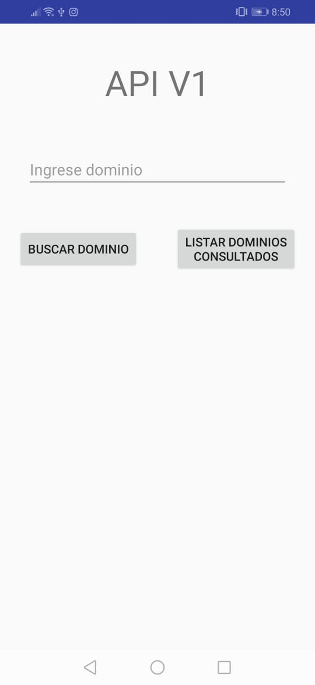
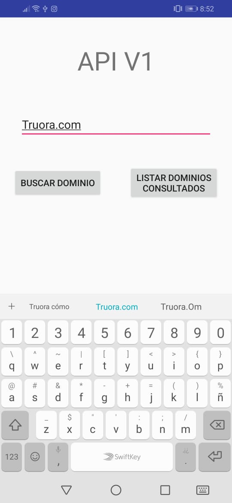
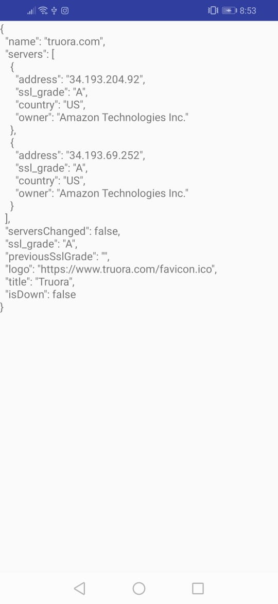
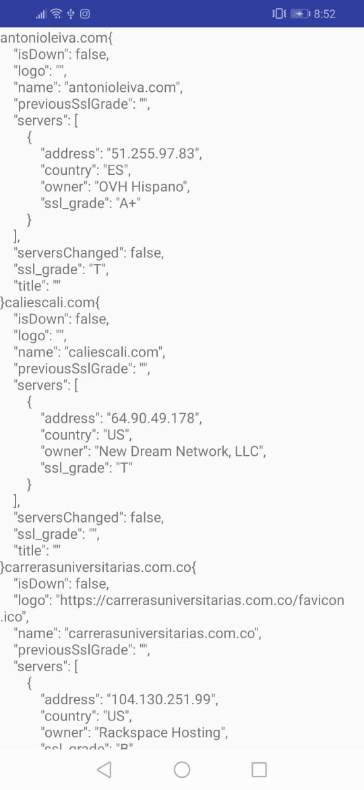

# APIgolang
This is the test for Truora.com

**Autor:** Joan Sebastián García Delgado  
**Tema:**  Build API with Golang
**Correo:** josegar0218@gmail.com

## API ENDPOINTS

### All Posts
- Path : `/list`
- Method: `GET`
- Response: `200`

### Details a Domain
- Path : `/dominio/{domainName}`
- Method: `GET`
- Response: `200`

## Required Packages

- Database
    * [CockroachDB](github.com/lib/pq)
- Routing
    * [chi](https://github.com/go-chi/chi)
- Tools
    * [Scrap](github.com/badoux/goscraper)
    * [Whois]("github.com/likexian/whois-go")
    * [Whois-parser]("github.com/ikermatias/whois-parser-go") 

## APP 
     

## Quick Run Project

TODO
Docker
```
git clone https://github.com/ikermatias/APIgolang.git


```
